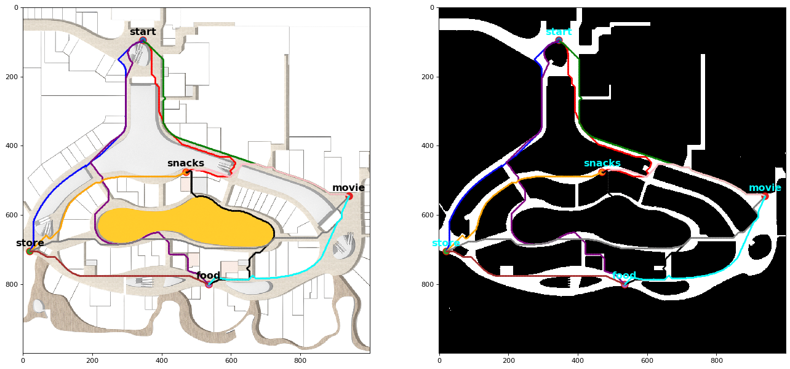
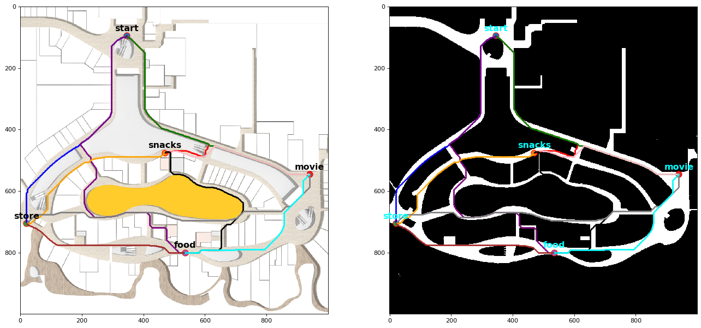
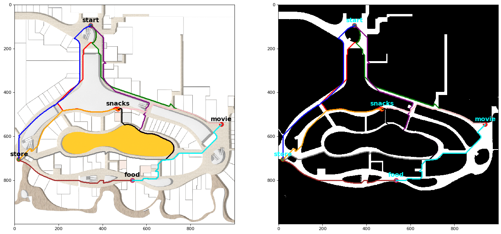

## Introduction
This task involves planning a path between five given key locations on a map of Vivocity level 2. The map is represented as a grid with each grid cell representing a 0.2m* 0.2m square area. The five locations on the map are: start, snacks, store, movie, and food.The goal is to find the most efficient route for a person to visit all four locations and return to the start. To solve this problem, various planning algorithms are used including A*, Dijkstra and Greedy Best First algorithm, and each algorithm has its pros and cons. We implement these algorithms and get the results of planned path, travelled distance, total run time and summarize the trade-offs between different algorithms.

## Implementation

### A* Implementation

### Dijkstra algorithm

### Greedy best first search

## Travelling shopper 

### DFS

### Dynamic programming
`Table_task3_DP` is the clarificaiton of specific steps of update.

## Files
`route`  all the pictures with "upper_part" means the routes right upper diagonal part in the distance table the and the "lower_part" means the routes left lower diagonal part in the distance table with the boundary of the diagonal 0.
    * `astar` 
    `.png` all the routes get with A* algorithm of different heuristic function
    `.txt` running time, total distance and routes detail
    * `dijkstra` 
    `.png` all the routes get with Dijkstra algorithm
    `.txt` running time, total distance and routes detail
    * `Greedy Best First Search`
    `.png` all the routes get with GBFS algorithm
    `.txt` running time, total distance and routes detail
    * `Task3` the plan route of DFS algorithm and DP algorithm

All the codes are in `homework3.ipynb` file

